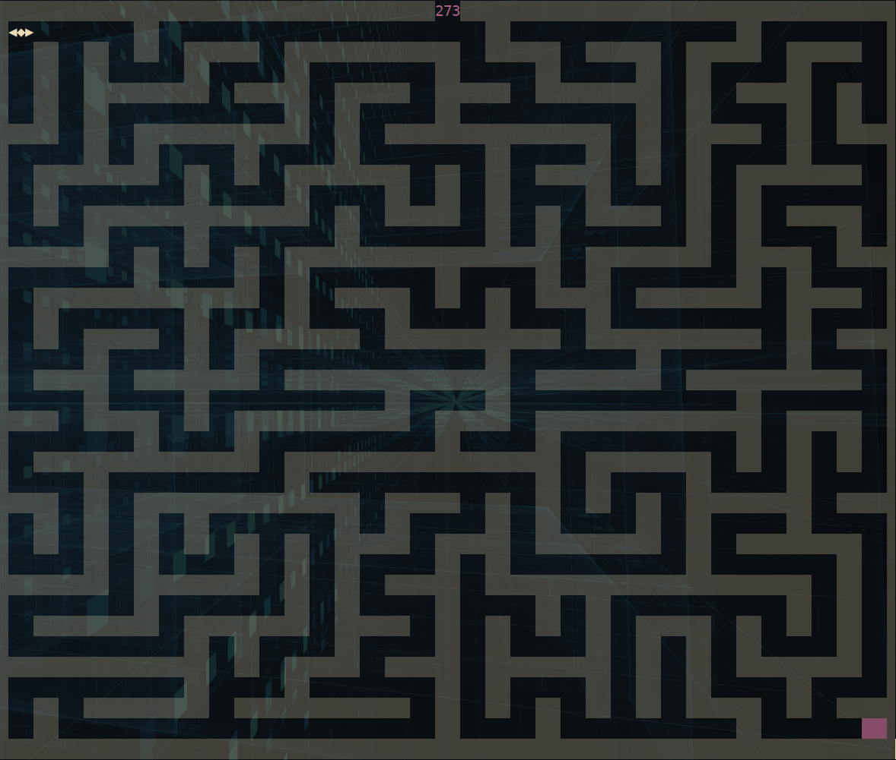

```
▓▓▓▓     ▓▓▓▓                            ▓▓▓▓     ▓▓▓▓
▓▓▓▓▓   ▓▓▓▓▓                            ▓▓▓▓▓   ▓▓▓▓▓
▓▓▓▓▓▓▓▓▓▓▓▓▓                            ▓▓▓▓▓▓▓▓▓▓▓▓▓
▓▓▓▓▓▓▓▓▓▓▓▓▓  ▓▓▓▓▓▓  ▓▓▓▓▓▓▓▓  ▓▓▓▓▓▓  ▓▓▓▓▓▓▓▓▓▓▓▓▓  ▓▓▓▓▓▓
▓▓▓ ▓▓▓▓▓ ▓▓▓     ▓▓▓▓    ▓▓▓▓  ▓▓▓  ▓▓▓ ▓▓▓ ▓▓▓▓▓ ▓▓▓ ▓▓▓  ▓▓▓
▓▓▓  ▓▓▓  ▓▓▓ ▓▓▓▓▓▓▓▓   ▓▓▓▓   ▓▓▓▓▓▓▓▓ ▓▓▓  ▓▓▓  ▓▓▓ ▓▓▓▓▓▓▓▓
▓▓▓   ▓   ▓▓▓ ▓▓▓  ▓▓▓  ▓▓▓▓    ▓▓▓▓     ▓▓▓   ▓   ▓▓▓ ▓▓▓▓
▓▓▓       ▓▓▓ ▓▓▓▓▓▓▓▓ ▓▓▓▓▓▓▓▓  ▓▓▓▓▓▓  ▓▓▓       ▓▓▓  ▓▓▓▓▓▓
```
-----

Generate a solvable maze in your terminal.


# Installation
1. Clone the repository.
2. Run `cargo install --path .`
3. Run `mazeme` in your terminal to launch a maze!

## Troubleshooting
1. Installion requires Rust.
    - Follow the instructions here: https://www.rust-lang.org/tools/install,
    or run `curl --proto '=https' --tlsv1.2 -sSf https://sh.rustup.rs | sh`
2. If you get an error regarding libc, you may need to install `gcc`.
    - On Ubuntu, run `sudo apt get install build-essential`
